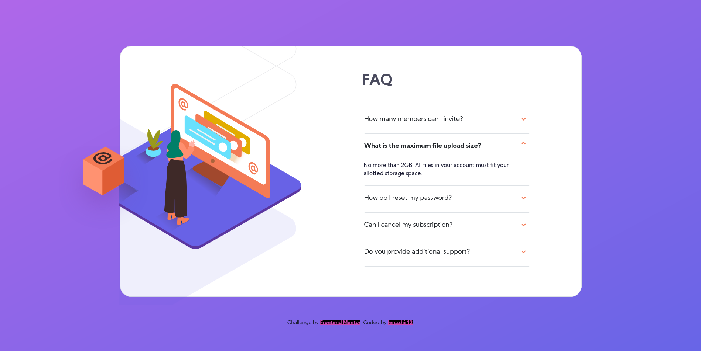

# Frontend Mentor - FAQ accordion card solution

This is a solution to the [FAQ accordion card challenge on Frontend Mentor](https://www.frontendmentor.io/challenges/faq-accordion-card-XlyjD0Oam). Frontend Mentor challenges help you improve your coding skills by building realistic projects. 

## Table of contents

- [Overview](#overview)
  - [The challenge](#the-challenge)
  - [Screenshot](#screenshot)
  - [Links](#links)
- [My process](#my-process)
  - [Built with](#built-with)
  - [What I learned](#what-i-learned)
  - [Continued development](#continued-development)
  - [Useful resources](#useful-resources)
- [Author](#author)
- [Acknowledgments](#acknowledgments)

## Overview

### The challenge

Users should be able to:

- View the optimal layout for the component depending on their device's screen size
- See hover states for all interactive elements on the page
- Hide/Show the answer to a question when the question is clicked

### Screenshot

### Links

- Solution URL: [check my solution here!](https://github.com/lenazhir12/faq-accordion-card-main.git)
- Live Site URL: [Check it live here!](https://lenazhir12.github.io/faq_accordion_card_main--frontEndMentor/)

## My process

### Built with

- Semantic HTML5 markup
- CSS custom properties
- Flexbox
- CSS Grid

- [Bootstrap framework](https://www.bootstrap.com/) - For styles

### What I learned

-so much, lot of googlling!!!

If you want more help with writing markdown, we'd recommend checking out [The Markdown Guide](https://www.markdownguide.org/) to learn more.

### Continued development

lots of practice and understanding on display elements, images and ect.

### Useful resources

- [Mozilla Developer Org](https://www.developer.mozilla.org) - for css and other stuff
- [Bootstrap](https://www.bootstrap.com) - for styling, first time using bootstrap

## Author

- Website - [lenazhir12](#)
- Frontend Mentor - [@lenazhir12](https://www.frontendmentor.io/profile/lenazhir12)

## Acknowledgments

THANK YOU! GOOGLE!!
FRONTEND MENTOR

